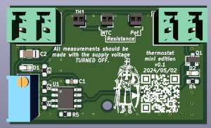
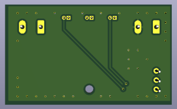

# Thermostat mini:  
Mini board for turning on the fan when the thermocouple heats up. The setting  
is made by measuring the resistance with a multimeter.  

### Schemes:  
###### thermostat_mini_v0.1:  
[pdf](docs/thermostat_mini_v0.1.pdf)  

### Images:  
###### thermostat_mini_v0.1:  
top:  
  
bottom:  
  

###### gerber:  
Archive for production:  
[thermostat_mini_v0.1](https://github.com/piro-s/thermostat_mini/raw/main/gerber/thermostat_mini_v0.1.zip)  